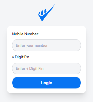

# Payoo Mobile Banking App
> Noted that this is dummy project only work 'Add money' & 'Cash out' section and there is no database so  Default mobile number : `0123456789`   default pin : `1234`

Live page: [Payoo](https://istiakahmedsaad.github.io/Payoo-Banking-App/)

## Login

## Home

_Technology use:_
1. [Tailwind CSS](https://tailwindcss.com/docs/installation)
2. [Daisyui Component Library](https://daisyui.com/docs/install/)
3. [Remixicon Icon](https://remixicon.com/)
